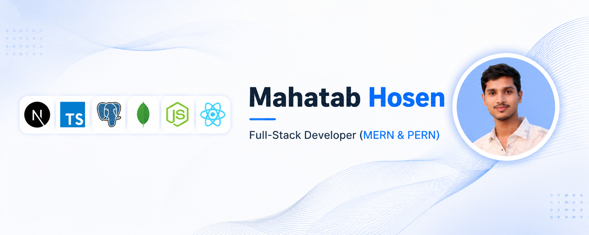

<!-- Cover Image -->

# 👋 Hi, I'm Md. Mahatab Hosen Raju

<!-- Typing SVG -->

  

---

## 🚀 Introduction
A proactive and results-driven **Full Stack Developer** from Bangladesh, dedicated to building dynamic, intuitive, and high-performance web applications.

## 💼 Professional Summary
Expert in the **MERN & PERN** stacks with a strong focus on **Next.js** and **Node.js**. I specialize in developing scalable **SaaS MVPs** and modern web solutions, leveraging robust backend architectures and seamless frontend experiences to drive business value.

---

## 🛠️ Tech Stack

### 🎨 Frontend Tools

### ⚙️ Backend Tools

### 💾 Databases

### 🔧 SEO & Tools/DevOps

---

## 📬 Contact Links

---

## 📊 GitHub Analytics

  

